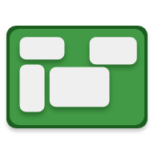
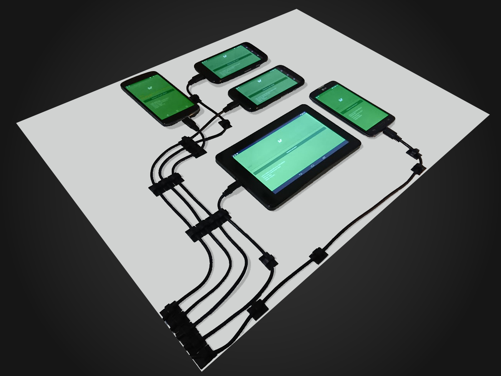

# CellWall

A multi-device display for showing interactive data, such as photos, weather
information, calendar appointments, and more.

CellWall is my project to repurpose a batch of old hand-me-down cell phones into
a useful display in my dorm room. It uses WebSockets to let each phone connect
to a server and receive data about what to display.



## Getting Started

These instructions will get you a copy of the project up and running on your
local machine for development and testing purposes. See deployment for notes on
how to deploy the project on a live system.

### Prerequisites

-   Node.js 10 or greater
-   Android Studio 3.2 or greater

### Installing

Install NPM dependencies for the server:

```shell
cd ./server
npm install
```

Install Gradle dependencies for the client by opening the `./android` folder as
an Android Studio project and syncing Gradle.

From the command line:

```shell
cd ./android
gradlew build
```

## Deployment

Run the server by compiling the TypeScript code and launching it with node:

```shell
cd ./server
npm run build # Runs `tsc` to compile TypeScript
npm start # Runs `node src/index.js` to start server
```

When running the client application, you will be prompted to enter a URL for
your server. Enter the path to your node server, such as `http://10.0.2.2:3000`.

## Built with

-   [Koa](https://koajs.com/) - Web server
-   [Socket.io](https://socket.io) - WebSocket library for client and server
-   [Android Architecture Components](https://developer.android.com/topic/libraries/architecture/) -
    Used for MVVM architecture on client
