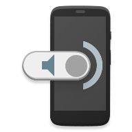

# smart-dorm
Code for my 'smart home' dorm room projects.

## CellWall
A multi-device display for showing interactive data,
such as photos, weather information, calendar appointments, and
more.

Android devices are controlled through an external computer running
ADB, and `adbkit` provides an interface to use ADB through Node.
Other actions may be triggered with Tasker and IFTTT.

A remote interface will also be provided through
a website dashboard, which will take advantage of the
Physical Web to broadcast a beacon link to the
dashboard (via PyBeacon).

SoundSeeder provides speaker functionality that syncs playback between all the
devices.

## Wireless doorbell
An Amazon Dash button is used as a wireless trigger for a doorbell.
The server monitors for signals from the button, then sends a command to an
Android phone attached to the door so it plays a sound and takes a picture
of the person who rung the doorbell.
