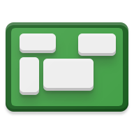

# cell-wall
> Code for my 'smart home' dorm room projects, including the Cell(phone)Wall and wireless doorbell.

### CellWall
A multi-device display for showing interactive data,
such as photos, weather information, calendar appointments, and
more.

Android devices are controlled through an external computer running
ADB, and `adbkit` provides an interface to use ADB through Node.
Other actions may be triggered with Tasker and IFTTT.

A remote interface will also be provided through
a website dashboard, which will take advantage of the
Physical Web to broadcast a beacon link to the
dashboard (via PyBeacon).

SoundSeeder provides speaker functionality that syncs playback between all the
devices.

### Wireless doorbell
An Amazon Dash button is used as a wireless trigger for a doorbell.
The server monitors for signals from the button, then sends a command to an
Android phone attached to the door so it plays a sound and takes a picture
of the person who rung the doorbell.

## Installing / Getting started

Start the server by running the index.js file with root privileges.

```shell
sudo node index.js
```

This starts a web server and listens for signals from Amazon Dash buttons. 
Actions can be activated either through the web triggers or Dash buttons.

For the doorbell, import the [door-tasker.xml](https://github.com/NotWoods/cell-wall/blob/master/on-device/door-tasker.xml) 
file into Tasker on the phone the doorbell sound should play from.
Also ensure both Tasker and AutoRemote are installed on that device.

## Developing

### Built With
* Node.js v8
* adbkit v2.10
* node-dash-button v0.6

### Prerequisites
node-dash-button doesn't work properly on Windows, so the server should be Unix based for everything to run properly.

### Setting up Dev

First install dependencies:

```shell
git clone https://github.com/NotWoods/cell-wall.git
cd cell-wall/
npm install
```

Secondly, copy the contents of [`secret-template.json`](https://github.com/NotWoods/cell-wall/blob/master/secret-template.json)
into a file named `secret.json`. Fill in the corresponding fields with API keys and MAC addresses. 

## Configuration

Secret API keys go inside the `secret.json` file.

- **ifttt\_maker**: API key for the IFTTT maker channel
- **autoremote**: API key for AutoRemote
- **dash\_buttons.doorbell**: MAC address of the Dash button that triggers the doorbell
- **dash\_buttons.cellwall\_power**: MAC address of the Dash button that toggles power of the CellWall devices

## API Reference

### GET `/status/devices-on`
Returns data about the power state for the phones.

### GET `/cmd/doorbell`
Triggers the doorbell noise and informs IFTTT of the doorbell press.

### GET `/cmd/cellwall-power`
Toggles power of the CellWall devices
